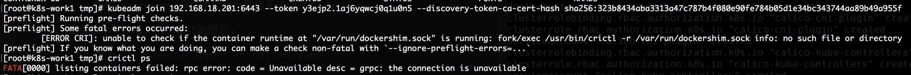

### Centos7上安装kubernetes-v1.10

---
    由于kubernetes是google出品，所以在国内被墙了，所有需要使用国内源来安装
    本例子使用的是aliyun的源，具体的操作是执行以下：
    
    $cat <<EOF > /etc/yum.repos.d/kubernetes.repo
    
    [kubernetes]
    
    name=Kubernetes
    
    baseurl=http://mirrors.aliyun.com/kubernetes/yum/repos/kubernetes-el7-x86_64
    
    enabled=1
    
    gpgcheck=0
    
    repo_gpgcheck=0
    
    gpgkey=http://mirrors.aliyun.com/kubernetes/yum/doc/yum-key.gpg
    
            http://mirrors.aliyun.com/kubernetes/yum/doc/rpm-package-key.gpg
    
    EOF
    
---

- **环境准备**

---
    准备来三台虚拟机，（虚拟机使用的是VirtualBox）具体如下：
    
    |      IP      |   角色  |   版本   |
    |192.168.18.201| master | v1.10.0  |
    |192.168.18.203| work1  | v1.10.0  |
    |192.168.18.210| work2  | v1.10.0  |
    
    1、每台上面安装好docker，本例子中使用的是docker-ce-17.03.2.ce版本
    2、永久关闭selinux
       
       vim /etc/selinux/config
            selinux = disabled
    
    3、临时关闭selinux
        setenfore 0
    
    4、关闭swap
        
        swapoff -a #临时关闭
        
        vim /etc/fstab 里面的内容全部注释，保存，退出，（永久关闭）
       
          
---

- **安装k8s组件**

---
    1、安装k8s组件
        yum install -y kubelet kubeadm kubectl #最新版本
        
        yum install -y kubelet-v1.10.0 kubeadm-v1.10.0 kubectl-v1.10.0 #指定版本
        
    2、配置kubelet的cgroup drive
    
       确保docker 的cgroup drive 和kubelet的cgroup drive一样    
       
       $ sudo docker info | grep -i cgroup #查看docker的cgroup
       
       $ sudo cat /etc/systemd/system/kubelet.service.d/10-kubeadm.conf #查看kubernetes的cgroup
       
       若显示不一样，则执行：
       $ sudo sed -i "s/cgroup-driver=systemd/cgroup-driver=cgroupfs/g" /etc/systemd/system/kubelet.service.d/10-kubeadm.conf
       $ sudo systemctl daemon-reload
       如图：
   
    
    3、启动kubelet，注意，根据官方文档描述，安装kubelet、kubeadm、kubectl三者后，要求启动kubelet：
        
       systemctl enable kubelet && systemctl start kubelet
       但实际测试发现，无法启动，报如下错误
   
    
    查看日志后发现没有证书：
    unable to load client CA file /etc/kubernetes/pki/ca.crt: open /etc/kubernetes/pki/ca.crt: no such file or directory
    
    这个时候别慌。。。
    kubeadm init操作会创建证书。也就是说，现在无法启动并不影响后续操作，继续！

- **安装k8s**

---
    本文使用的是K8S官方提供的kubeadm工具来初始化K8S集群，而初始化操作kubeadm init会默认去访问谷歌的服务器，以下载集群所依赖的Docker镜像，因此也会超时失败，你懂得。
    所以，需要我们提前准本好镜像，就不会访问google了，或者可以利用Docker Hub制作镜像等，但稍显繁琐。
    这里注本的镜屏幕快照 2018-08-28 下午3.01.24像是v1.10.0
    导入镜像后，完成

- **创建集群**

---
    前面的工作都准备好后，我们就可以真正的创建集群了。这里使用的是官方提供的kubeadm工具，它可以快速、方便的创建一个K8S集群。
    kubeadm的具体介绍大家可以参考官方文档：https://kubernetes.io/docs/setup/independent/create-cluster-kubeadm/。
    
    1、创建集群
       在Master主节点（k8s-node1）上执行
       kubeadm init --pod-network-cidr=192.168.0.0/16 --kubernetes-version=v1.10.0 --apiserver-advertise-address=192.168.56.101
       
       含义：
       1.选项--pod-network-cidr=192.168.0.0/16表示集群将使用Calico网络，这里需要提前指定Calico的子网范围
       2.选项--kubernetes-version=v1.10.0指定K8S版本，这里必须与之前导入到Docker镜像版本v1.10.0一致，否则会访问谷歌去重新下载K8S最新版的Docker镜像
       3.选项--apiserver-advertise-address表示绑定的网卡IP，这里一定要绑定前面提到的enp0s8网卡，否则会默认使用enp0s3网卡
       4.若执行kubeadm init出错或强制终止，则再需要执行该命令时，需要先执行kubeadm reset重置
       
       如果执行过程中出现：
       http://localhost:10235, connected refusal.
       请查看日志：本文中主要是docker kubernetes cgroup 不一致导致
       
       看到：
   
       
       说明成功。
       另外， 提示我们还需要创建网络，并且让其他节点执行kubeadm join...加入集群
    
    2、创建网络
        如果不创建网络，查看pod状态时，可以看到kube-dns组件是阻塞状态，集群时不可用的：
        
        $ sudo kubectl get pod -n kube-system
     
   
    
    参考官方文档，根据需求选择适合的网络，这里，我们使用Calico
    根据官方文档，在主节点上，需要执行如下命令：
    kubectl apply -f https://docs.projectcalico.org/v3.1/getting-started/kubernetes/installation/hosted/kubeadm/1.7/calico.yaml
    
    但需要注意的是:
        本文实验时所使用的calico的docker镜像版本为v3.1.0
        calico.yaml文件中版本已升级为v3.1.3因此我们需要下载calico.yaml，手动编辑文件修改为v3.1.0并重新创建网络
        否则，执行kubectl apply命令时，会重新拉取v3.1.1的镜像导致超时失败
        同时，kube-dns模块也会因为网络无法创建而Pending
        
    确保版本一致后，执行成功则提示:
        
        $ sudo kubectl apply -f calico.yaml
        
   
        
    5、集群设置
       
       将Master作为工作节点
       K8S集群默认不会将Pod调度到Master上，这样Master的资源就浪费了。在Master（即k8s-node1）上，可以运行以下命令使其作为一个工作节点：
       
       $sudo kubectl taint nodes --all node-role.kubernetes.io/master-
       
    6、将其他节点加入集群
        在其他两个节点k8s-work1和k8s-work2，执行主节点生成的kubeadm join命令即可加入集群：
        kubeadm join 192.168.18.201:6443 --token d9ojbv.r295hce00nr63q4z --discovery-token-ca-cert-hash sha256:48e6f9844949dcd37c8aac1cf31b27eae4edd7c26e8cf37ae64b4e9f71065007
        
        如果出现：
      
        
        请执行：
         $ sudo yum remove cri-tools
         完成后，再次执行：
         $ sudo kubeadm join ...就可以了
             
        

       