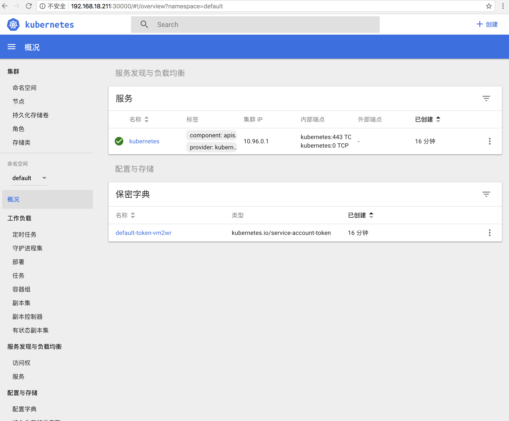

### minikube 安装
Minikube 是一个轻量级的 Kubernetes 实现，会在本机创建一台虚拟机，并部署一个只包含一个节点的简单集群。 Minikube 适用于 Linux, Mac OS 和 Windows 系统。Minikube CLI 提供了集群的基本引导操作，包括启动、停止、状态和删除。为了完成此基础训练，您将使用预先安装了 Minikube 的在线终端。

- **minikube安装**

---
    具体的可以查看：
        https://github.com/kubernetes/minikube/
    在国内安装
    curl -Lo minikube https://storage.googleapis.com/minikube/releases/latest/minikube-linux-amd64 && chmod +x minikube && sudo cp minikube /usr/local/bin/ && rm minikube
    curl -Lo kubectl https://storage.googleapis.com/kubernetes-release/release/$(curl -s https://storage.googleapis.com/kubernetes-release/release/stable.txt)/bin/linux/amd64/kubectl && chmod +x kubectl && sudo cp kubectl /usr/local/bin/ && rm kubectl
    这些都被墙了，所以，有以下策略：
    1、从github上下载release对应的OS版本后，执行：
    chmod +x minikube && sudo cp minikube /usr/local/bin/ && rm minikube
    2、从aliyun上下载：
    
        Mac OSX：
        
        curl -Lo minikube http://kubernetes.oss-cn-hangzhou.aliyuncs.com/minikube/releases/v0.28.1/minikube-darwin-amd64 && chmod +x minikube && sudo mv minikube /usr/local/bin/
        
        Linux：
        
        curl -Lo minikube http://kubernetes.oss-cn-hangzhou.aliyuncs.com/minikube/releases/v0.28.1/minikube-linux-amd64 && chmod +x minikube && sudo mv minikube /usr/local/bin/
    
    3、从源码进行编译：
       
       git clone https://github.com/kubernetes/minikube.git
       cd minikube
       make
       sudo cp out/minikube /usr/local/bin/
    4、安装docker
       查看docker安装说明

    5、启动：
        
        缺省Minikube使用VirtualBox驱动来创建Kubernetes本地环境
        minikube start --registry-mirror=https://registry.docker-cn.com   
     
        缺省启动(一般linux)：
          minikube start --vm-driver=none
- **验证**

---
    1、查看版本信息，执行命令：
      $ kubectl version
        Client Version: version.Info{Major:"1", Minor:"10", GitVersion:"v1.10.0", GitCommit:"fc32d2f3698e36b93322a3465f63a14e9f0eaead", GitTreeState:"clean", BuildDate:"2018-03-26T16:55:54Z", GoVersion:"go1.9.3", Compiler:"gc", Platform:"linux/amd64"}
        Server Version: version.Info{Major:"1", Minor:"10", GitVersion:"v1.10.0", GitCommit:"fc32d2f3698e36b93322a3465f63a14e9f0eaead", GitTreeState:"clean", BuildDate:"2018-03-26T16:44:10Z", GoVersion:"go1.9.3", Compiler:"gc", Platform:"linux/amd64"}
    
    2、查看集群
       
      $ kubectl cluster-info
        Kubernetes master is running at https://192.168.18.211:8443
        KubeDNS is running at https://192.168.18.211:8443/api/v1/namespaces/kube-system/services/kube-dns:dns/proxy
        
        To further debug and diagnose cluster problems, use 'kubectl cluster-info dump'.
        
    3、查看节点：
        
      $ kubectl get nodes
        NAME       STATUS    ROLES     AGE       VERSION
        minikube   Ready     master    5m        v1.10.0

- **打开kubernetes控制台**

    
    $ minikube dashboard 或 minikube dashboard --url http://ip+port
        Opening kubernetes dashboard in default browser...
    在游览器中输入http://ip:port进行查看，默认端口为（30000）
    
    如果不知道，请使用命令：
    
    $ kubectl -n kube-system get svc kubernetes-dashboard
    进行查看
    
  
  

- **简单使用**
    
---
    1、查看pods：
        $ kubectl get pods
          no resources
    部署一个pod:
        
        $ kubectl run kubernetes-bootcamp --image=registry.cn-beijing.aliyuncs.com/typ/kubernetes-bootcamp:v1 --port 8080
            deployment.apps "kubernetes-bootcamp" created
            
    2、查看部署：
        $ kubectl get deployment
          NAME                  DESIRED   CURRENT   UP-TO-DATE   AVAILABLE   AGE
          kubernetes-bootcamp   1         1         1            1           42s
    
    3、查看services
        $ kubectl get services
            NAME         TYPE        CLUSTER-IP   EXTERNAL-IP   PORT(S)   AGE
            kubernetes   ClusterIP   10.96.0.1    <none>        443/TCP   46m
   
    4、部署一个service
        
        $ kubectl expose deployment/kubernetes-bootcamp --type="NodePort" --port 8080
            service "kubernetes-bootcamp" exposed
    5、查看service详情
        $ kubectl describe services/kubernetes-bootcamp
            Name:                     kubernetes-bootcamp
            Namespace:                default
            Labels:                   run=kubernetes-bootcamp
            Annotations:              <none>
            Selector:                 run=kubernetes-bootcamp
            Type:                     NodePort
            IP:                       10.98.180.124
            Port:                     <unset>  8080/TCP
            TargetPort:               8080/TCP
            NodePort:                 <unset>  32413/TCP
            Endpoints:                172.17.0.4:8080
            Session Affinity:         None
            External Traffic Policy:  Cluster
            Events:                   <none>
            
    6、创建一个端口的环境变量并查看
        
        $export NODE_PORT=$(kubectl get services/kubernetes-bootcamp -o go-template='{{(index .spec.ports 0).nodePort}}')
        $ echo NODE_PORT=$NODE_PORT
         NODE_PORT=30702
    
    7、测试服务：
        $curl $(minikube ip):$NODE_PORT
          Hello Kubernetes bootcamp! | Running on: kubernetes-bootcamp-6956675994-bcw8p | v=1
    
    8、查看pod的label名称 
        $kubectl describe deployment
          Name:                   kubernetes-bootcamp
          Namespace:              default
          CreationTimestamp:      Tue, 28 Aug 2018 06:06:48 -0400
          Labels:                 run=kubernetes-bootcamp
          Annotations:            deployment.kubernetes.io/revision=1
          Selector:               run=kubernetes-bootcamp
          Replicas:               1 desired | 1 updated | 1 total | 1 available | 0 unavailable
          StrategyType:           RollingUpdate
          MinReadySeconds:        0
          RollingUpdateStrategy:  1 max unavailable, 1 max surge
          Pod Template:
            Labels:  run=kubernetes-bootcamp
            Containers:
             kubernetes-bootcamp:
              Image:        registry.cn-beijing.aliyuncs.com/typ/kubernetes-bootcamp:v1
              Port:         8080/TCP
              Host Port:    0/TCP
              Environment:  <none>
              Mounts:       <none>
            Volumes:        <none>
          Conditions:
            Type           Status  Reason
            ----           ------  ------
            Available      True    MinimumReplicasAvailable
            Progressing    True    NewReplicaSetAvailable
          OldReplicaSets:  <none>
          NewReplicaSet:   kubernetes-bootcamp-6956675994 (1/1 replicas created)
          Events:
            Type    Reason             Age   From                   Message
            ----    ------             ----  ----                   -------
            Normal  ScalingReplicaSet  18m   deployment-controller  Scaled up replica set kubernetes-bootcamp-6956675994 to 1
            
    9、根据label查询pod：
        $ kubectl get pods -l run=kubernetes-bootcamp
           NAME                                   READY     STATUS    RESTARTS   AGE
           kubernetes-bootcamp-6956675994-bcw8p   1/1       Running   0          20m
        
    10、根据label查询service
        $kubectl get services -l run=kubernetes-bootcamp
          NAME                  TYPE       CLUSTER-IP      EXTERNAL-IP   PORT(S)          AGE
          kubernetes-bootcamp   NodePort   10.98.180.124   <none>        8080:32413/TCP   18m
    
    11、创建一个POD_NAME作为环境变量
    
        $ export POD_NAME=$(kubectl get pods -o go-template --template '{{range .items}}{{.metadata.name}}{{"\n"}}{{end}}')
        $ echo Name of the Pod: $POD_NAME
          kubernetes-bootcamp-6956675994-bcw8p
    
    12、重命名label：
        
        $kubectl label pod $POD_NAME app=v1
          pod "kubernetes-bootcamp-6956675994-bcw8p" labeled
    
    13、根据pod label查看详情
        $kubectl describe pods $POD_NAME
          Name:           kubernetes-bootcamp-6956675994-bcw8p
          Namespace:      default
          Node:           minikube/192.168.18.211
          Start Time:     Tue, 28 Aug 2018 06:06:48 -0400
          Labels:         app=v1
                          pod-template-hash=2512231550
                          run=kubernetes-bootcamp
          Annotations:    <none>
          Status:         Running
          IP:             172.17.0.4
          Controlled By:  ReplicaSet/kubernetes-bootcamp-6956675994
          Containers:
            kubernetes-bootcamp:
              Container ID:   docker://1812e8d3ef303b5ae5581cc75d692c5154b9743b7a3ee41ae4bbedf4484e5328
              Image:          registry.cn-beijing.aliyuncs.com/typ/kubernetes-bootcamp:v1
              Image ID:       docker-pullable://registry.cn-beijing.aliyuncs.com/typ/kubernetes-bootcamp@sha256:34e5a47d302ee20039e5f0eb1e2f49785dafee3d97cac704befba6c1c7c938fc
              Port:           8080/TCP
              Host Port:      0/TCP
              State:          Running
                Started:      Tue, 28 Aug 2018 06:06:49 -0400
              Ready:          True
              Restart Count:  0
              Environment:    <none>
              Mounts:
                /var/run/secrets/kubernetes.io/serviceaccount from default-token-vm2wr (ro)
          Conditions:
            Type           Status
            Initialized    True 
            Ready          True 
            PodScheduled   True 
          Volumes:
            default-token-vm2wr:
              Type:        Secret (a volume populated by a Secret)
              SecretName:  default-token-vm2wr
              Optional:    false
          QoS Class:       BestEffort
          Node-Selectors:  <none>
          Tolerations:     node.kubernetes.io/not-ready:NoExecute for 300s
                           node.kubernetes.io/unreachable:NoExecute for 300s
          Events:
            Type    Reason                 Age   From               Message
            ----    ------                 ----  ----               -------
            Normal  Scheduled              28m   default-scheduler  Successfully assigned kubernetes-bootcamp-6956675994-bcw8p to minikube
            Normal  SuccessfulMountVolume  28m   kubelet, minikube  MountVolume.SetUp succeeded for volume "default-token-vm2wr"
            Normal  Pulled                 28m   kubelet, minikube  Container image "registry.cn-beijing.aliyuncs.com/typ/kubernetes-bootcamp:v1" already present on machine
            Normal  Created                28m   kubelet, minikube  Created container
            Normal  Started                28m   kubelet, minikube  Started container
    
    14、根据pod label查看
        $ kubectl get pods -l app=v1
          NAME                                   READY     STATUS    RESTARTS   AGE
          kubernetes-bootcamp-6956675994-bcw8p   1/1       Running   0          30m
     
    15、删除一个service
        
        $kubectl delete service -l run=kubernetes-bootcamp
          service "kubernetes-bootcamp" deleted
    
    16、在pod中查看服务：
        $kubectl exec -ti $POD_NAME curl localhost:8080
          Hello Kubernetes bootcamp! | Running on: kubernetes-bootcamp-6956675994-bcw8p | v=1
    
            